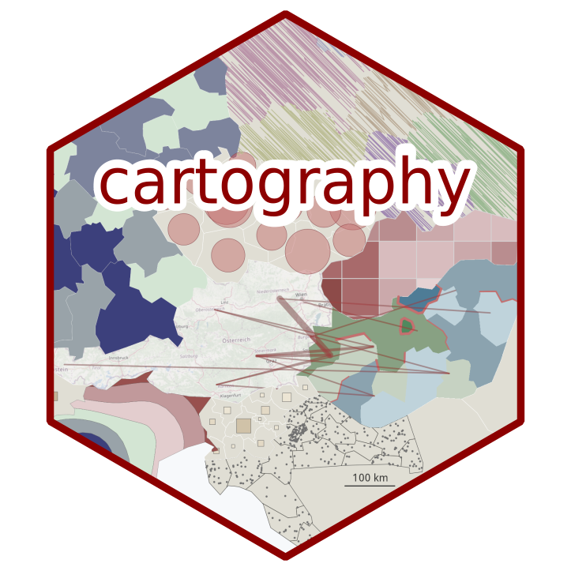
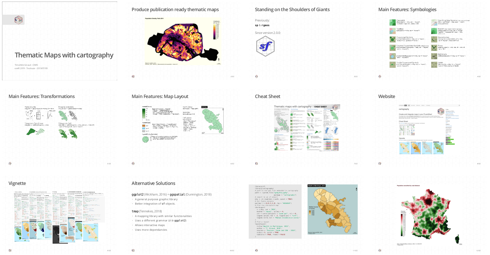

# [Thematic Maps with cartography](https://rcarto.github.io/user2019) 

**Timothée Giraud** - CNRS    
**[useR! 2019](http://www.user2019.fr/) - Toulouse - 2019/07/09**  

## Abstract
The R spatial ecosystem is blooming and dealing with spatial objects and spatial computations has never been so easy. In this context, the `cartography` package aim is to create thematic maps with the visual quality of those designed with classical mapping or GIS tools.  

The package helps to design cartographic representations such as proportional symbols, choropleth, typology, flows or discontinuities maps. It also offers several features that improve the graphic presentation of maps, for instance, map palettes, layout elements (scale, north arrow, title...), labels or legends.  
`cartography` is a mature package (first release in 2015), it has already been reviewed in both software and cartography focused journals (Giraud, Lambert 2016 & Giraud, Lambert 2017). It follows current good practices by using continuous integration and a test suite. A vignette, a cheat sheet and a companion website help new users to start using the package.   

In this presentation we will firstly give an overview of the package main features. Then we will develop examples of use of the package along with other spatial related packages.   

*Giraud, T., & Lambert, N. (2016). cartography: Create and Integrate Maps in your R Workflow. The Journal of Open Source Software, 1(4), 1-2.*  
*Giraud, T., & Lambert, N. (2017, July). Reproducible cartography. In International Cartographic Conference (pp. 173-183). Springer, Cham.*
