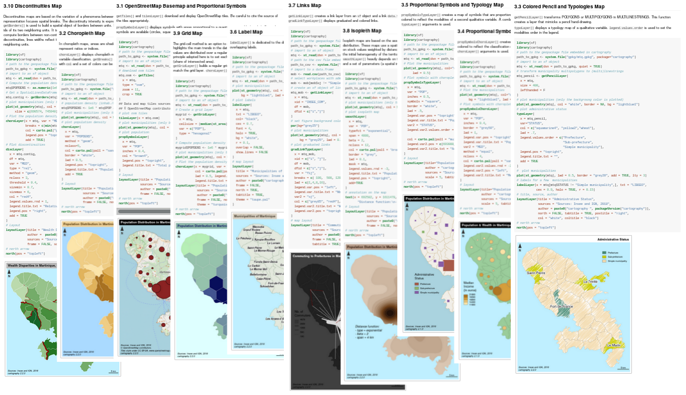
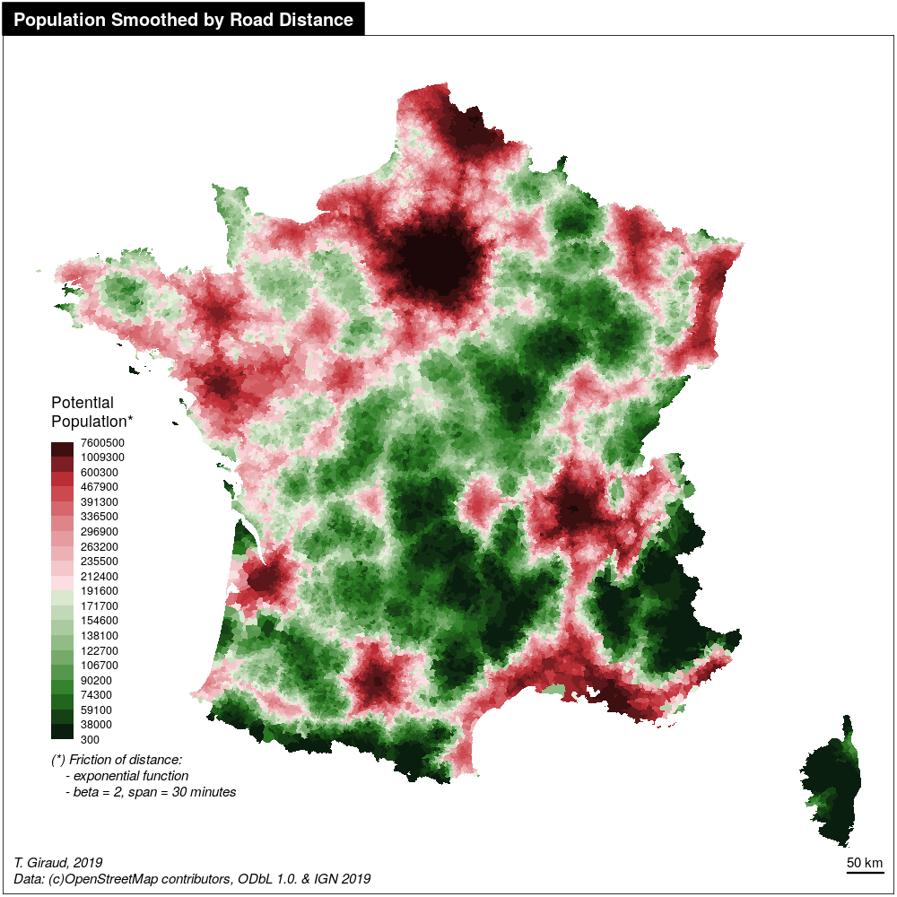

## Produce publication ready thematic maps

```{r echo=FALSE, out.width='75%', fig.align='center'}
knitr::include_graphics('img/parisdens.png')
```


## Standing on the Shoulders of Giants

### Previously:  
**`sp`** & **`rgeos`**

### Since version 2.0.0:  
```{r echo=FALSE}
knitr::include_graphics('img/sf.gif')
```

## Main Features: Symbologies

```{r echo=FALSE, fig.align='center'}
knitr::include_graphics('img/symbology.png', dpi=96)
```


## Main Features: Transformations

```{r echo=FALSE,  fig.align='center'}
knitr::include_graphics('img/trans.png',dpi = 96)
```


## Main Features: Map Layout

```{r echo=FALSE,  fig.align='center'}
knitr::include_graphics('img/layout.png',dpi = 96)
```


## Cheat Sheet

```{r echo=FALSE, out.width='650px', fig.align='center'}
knitr::include_graphics('img/cheat_sheet.png')
```

## Website

```{r echo=FALSE, out.width='60%', fig.align='center'}

```

## Vignette

```{r echo=FALSE, out.width='90%', fig.align='center'}

```

## Alternative Solutions

### `ggplot2` (Wickham, 2016) <small>+ `ggspatial` (Dunnington, 2018)</small>  
* A general purpose graphic library
* Better integration of `sf` objects.

### `tmap` (Tennekes, 2018)  
* A mapping library with similar functionalities
* Uses a different grammar (*à la* `ggplot2`)
* Allows interactive maps
* Uses more dependancies


## {.smaller}

<div class="columns-2">
```{r, message=FALSE, fig.width=5, fig.height=5}
library(sf)
library(cartography)
# path to the geo file embedded in cartography
path <- system.file("gpkg/mtq.gpkg", 
                    package = "cartography")
# import to an sf object
mtq <- st_read(dsn = path, quiet = TRUE)
# Set figure margins
par(mar = c(0,0,1.2,0), bg = "#b5d0d0")
# Plot the choropleth map
choroLayer(
  x = mtq, var = "MED", 
  method = "equal", nclass = 4, 
  col = carto.pal(pal1 = "sand.pal", n1 = 4),
  legend.values.rnd = -2, legend.pos = "left", 
  legend.title.txt = "Median Income\n(in euros)"
) 
# Plot a layout
layoutLayer(
  title="Wealth in Martinique, 2015", 
  author = "T. Giraud, 2019", 
  sources = "Sources: Insee and IGN - 2018", 
  scale = 5, north = TRUE,
  tabtitle = TRUE, frame = FALSE
)
```

</div>


## 
```{r echo=FALSE, out.width='60%', fig.align='center'}

```

##
<div class="columns-2">
```{r echo=FALSE, out.width=450,fig.align='center'}

```

</br>

</br>


* `osrm`: Get road distances (time) between each municipalities.    

* `SpatialPosition`: Compute gravitationnal accessibility based on road distances.    

* `cartography::getBreaks()`: Classify data

* `cartography::carto.pal()`: Use color palettes from the package

* `cartography::choroLayer()`: Plot the choropleth map
</div>

##

```{r echo=FALSE, out.width='100%', fig.align='center'}
knitr::include_graphics('img/dead.png')
```

<font size="1">[riatelab.github.io/MDM](https://riatelab.github.io/MDM/)</font>

##

<div class="columns-2">

```{r echo=FALSE, out.width='100%', fig.align='center'}
knitr::include_graphics('img/dead.png')
```

* `sf`: a lot geodata transformations

* `cartography::propSymbolsLayer()`: Display the proportional symbols

* `cartography::layoutLayer()`: Display the map layout
</div>


##
```{r echo=FALSE, out.width=400, fig.align='center'}
knitr::include_graphics('img/pencil.png')
```

<font size="1">[gist](https://gist.github.com/rCarto/b77c84da0b44de4c7aead4c0235c2968)</font>


##

<div class="columns-2">
```{r echo=FALSE, out.width=400, fig.align='center'}
knitr::include_graphics('img/pencil.png')
```


* `cartography::getPencilLayer()`: Transform polygons to hand-drawn polylines

* `cartography::choroLayer()`: Display a choropleth map

</div>

##
```{r echo=FALSE, out.width='75%', fig.align='center'}
knitr::include_graphics('img/paristanaka.png')
```

<font size="1">[rgeomatic.hypotheses.org](https://rgeomatic.hypotheses.org/1536)</font>


##

<div class="columns-2">

```{r echo=FALSE, fig.align='center'}
knitr::include_graphics('img/paristanaka.png')
```
</br>
</br>
</br>

* `spatstats`: Compute KDE  

* `tanaka`: Display the shaded contour lines    

* `cartography::LegendChoro()`: Plot the Legend

* `cartography::layoutLayer()`: Plot the map layout

</div>


##
```{r echo=FALSE, fig.align='center'}
knitr::include_graphics('img/disc.png', dpi=140)
```
<font size="1">[gist](https://gist.github.com/rCarto/7e1b86c9a1d5546f26a8d5eed824506c)</font>


## 
<div class="columns-2">
```{r echo=FALSE, out.width=450, fig.align='center'}
knitr::include_graphics('img/disc.png')
```

* `cartography::choroLayer()`: Plot a choropleth map

* `cartography::getBorders()`: Extract borders between countries

* `cartography::discLayer()`: Map the discontinuities on borders

* `cartography::layoutLayer()`: Map layout

</div>

## Thank You

<!-- ###   [frama.link/cartography](https://frama.link/cartography)   -->

###   [frama.link/cartography](https://frama.link/cartography)


</br>
  [github.com/riatelab/cartography](https://github.com/riatelab/cartography)  
</br>
  [\@rgeomatic](http://twitter.com/rgeomatic)  
</br>
  [rgeomatic.hypotheses.org](https://rgeomatic.hypotheses.org/)


</div>